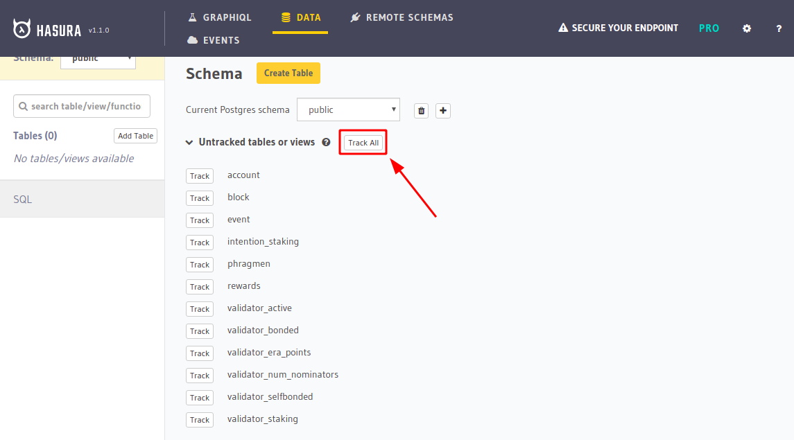

# PolkaStats Backend v3

New improved backend for https://polkastats.io!

<!--ts-->

### Table of Contents

   * [Installation Instructions](#installation-instructions)
   * [Usage Instructions](#usage-instructions)
   * [List of current containers](#list-of-current-containers)
   * [Updating containers](#updating-containers)
   * [Crawler](#crawler)
   * [Phragmen](#phragmen)


<!--te-->

## Installation Instructions

```
git clone https://github.com/Colm3na/polkastats-backend-v3.git
cd polkastats-backend-v3
npm install
```

## Usage Instructions

To launch all docker containers at once:
```
npm run docker
```
To run them separately:
```
npm run docker:<container-name>
```

## List of current containers

- substrate-node
- postgres
- graphql-engine
- crawler
- phragmen

## Updating containers

```
git pull
npm run docker:clean
npm run docker:build
npm run docker
```

## Crawler

This crawler container listens to new blocks and fills the database. There are a number of processes executed within this container. Some of this processes are triggered based on time configuration that can be seen in this file: [backend.config.js](https://github.com/Colm3na/polkastats-backend-v3/blob/develop/backend.config.js)
The crawler is able to detect and fill the gaps in postgres database by harvesting all the missing data, so it's safe and resilience against node outages or restarts.

## Phragmen

This container includes an offline-phragmen binary. It is a forked modification of [Kianenigma](https://github.com/kianenigma/offline-phragmen) repository.

## Hasura demo

Browse to http://localhost:8082

Click on "Data" at the top menu


Then add all tables to the tracking process



From now on, hasura will be collecting and tracking all the changes in the data base.

In order to check it and see its power you could start a new subscription or just perform an example query such us this one:


```
// Query example. Static
```

```
// Subscription example. Dynamic
```

